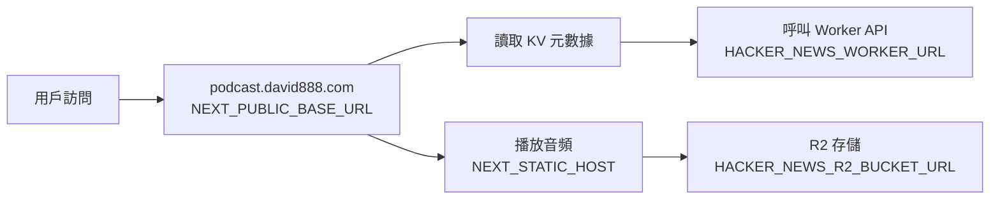

# DAVID888 Daily  每日放送

基於原始專案 [Hacker News 每日播報](https://github.com/ccbikai/hacker-news) 擴展開發

**專案倉庫**: https://github.com/tbdavid2019/daily-podcast

## 📚 文檔導航

本專案提供多個專門文檔，方便您快速找到所需資訊：

> 📖 **完整文檔索引**: 查看 [DOCS-INDEX.md](./DOCS-INDEX.md) 獲取詳細的文檔導覽和閱讀建議

| 文檔 | 說明 | 適合對象 |
|------|------|----------|
| [README.md](./README.md) | 專案介紹、快速開始、部署指南 | 所有使用者 |
| [DOCS-INDEX.md](./DOCS-INDEX.md) | 📖 **文檔索引與導覽** | 所有使用者 |
| [CONFIG-GUIDE.md](./CONFIG-GUIDE.md) | 詳細配置說明（天數限制、環境變數） | 部署與維護者 |
| [SECURITY.md](./SECURITY.md) | 安全指南、認證機制、應急響應 | 系統管理員 |
| [RSS-FIX-GUIDE.md](./RSS-FIX-GUIDE.md) | RSS Feed 修復說明、播客規範 | 播客開發者 |
| [CHANGELOG-新聞來源擴充.md](./CHANGELOG-新聞來源擴充.md) | 版本更新記錄、新功能說明 | 開發者 |

**📖 快速查找**：
- 🚀 想要開始使用？看本文檔的「快速開始」章節
- ⚙️ 配置遇到問題？查看 [CONFIG-GUIDE.md](./CONFIG-GUIDE.md)
- 🔒 關注安全性？閱讀 [SECURITY.md](./SECURITY.md)
- 📻 RSS Feed 問題？參考 [RSS-FIX-GUIDE.md](./RSS-FIX-GUIDE.md)
- 📚 不知道看哪個文檔？從 [DOCS-INDEX.md](./DOCS-INDEX.md) 開始

---

## ✨ 專案簡介

基於 AI 技術的多元科技新聞播客，每日彙整 Hacker News、GitHub Trending、Product Hunt、Dev.to 等優質內容，自動生成繁體中文摘要並轉換為播客節目。

**預覽地址**: https://podcast.david888.com

**RSS 訂閱**: https://podcast.david888.com/rss.xml

## 🌟 新聞來源

- 🔥 **Hacker News** - 程式設計師最愛的科技新聞社群
- 🚀 **GitHub Trending** - 最熱門的開源專案 (使用 DeepWiki 增強)
- 🏆 **Product Hunt** - 創新產品發現平台
- 💻 **Dev.to** - 開發者技術文章精選
- 📱 **Reddit** - 科技社群熱門討論

## 📅 週期性內容排程

為了避免重複內容並優化資源使用，系統實施智慧的週期性抓取策略：

### 每日更新來源

- **🔥 Hacker News** - 科技新聞每天都有新內容
- **📱 Reddit** - 論壇討論每天都有熱門話題

### 週期性更新來源

- **週一**: 💻 **Dev.to** - 週度技術文章趨勢
- **週三**: 🏆 **Product Hunt** - 產品發布和創新展示
- **週四**: 🚀 **GitHub Trending** - 開源專案趨勢

### 📊 實際數量分配

**生產環境 (WORKER_ENV=production)**:

| 星期 | Hacker News | Reddit | GitHub | Product Hunt | Dev.to | 總計 |
|------|-------------|--------|--------|--------------|--------|------|
| 週一 | 10 | 10 | 0 | 0 | 10 | **30** |
| 週二 | 10 | 10 | 0 | 0 | 0 | **20** |
| 週三 | 10 | 10 | 0 | 5 | 0 | **25** |
| 週四 | 10 | 10 | 5 | 0 | 0 | **25** |
| 週五 | 10 | 10 | 0 | 0 | 0 | **20** |
| 週六 | 10 | 10 | 0 | 0 | 0 | **20** |
| 週日 | 10 | 10 | 0 | 0 | 0 | **20** |

**開發環境 (WORKER_ENV≠production)**:

| 星期 | Hacker News | Reddit | GitHub | Product Hunt | Dev.to | 總計 |
|------|-------------|--------|--------|--------------|--------|------|
| 週一 | 3 | 3 | 0 | 0 | 2 | **8** |
| 週二 | 3 | 3 | 0 | 0 | 0 | **6** |
| 週三 | 3 | 3 | 0 | 2 | 0 | **8** |
| 週四 | 3 | 3 | 2 | 0 | 0 | **8** |
| 週五-日 | 3 | 3 | 0 | 0 | 0 | **6** |

### 🏗️ 技術實作架構

**雙層處理機制**：

1. **`workflow/utils.ts`**: 無條件抓取所有來源，確保數據完整性
2. **`workflow/index.ts`**: 根據星期幾動態設置 `storyLimits`，控制最終使用數量

**實作邏輯** (`workflow/index.ts` 約第86-105行)：

```typescript
// 根據星期幾動態設置各來源的限制
const getStoryLimits = () => {
  const baseLimit = isDev ? 2 : 5
  const hackerNewsLimit = isDev ? 3 : 10
  const redditLimit = isDev ? 3 : 10       // 增加到 10（原本 5）

  return {
    'hacker-news': hackerNewsLimit,                           // 每日更新
    'github-trending': dayOfWeek === 4 ? baseLimit : 0,       // 週四
    'product-hunt': dayOfWeek === 3 ? baseLimit : 0,          // 週三  
    'dev-to': dayOfWeek === 1 ? (isDev ? 2 : 10) : 0,         // 週一
    'reddit': redditLimit,                                     // 每日更新
  }
}
```

### 排程優勢

- 🔄 **避免重複內容** - 變化較慢的來源採用週期性更新
- ⚡ **提升效率** - 減少不必要的 API 調用
- 📊 **資源優化** - 符合 Cloudflare Workers 限制
- 🎯 **內容新鮮度** - 確保每日都有新的內容組合
- 🛡️ **容錯機制** - 即使週期性來源失效，仍有每日來源保證內容

## 🎯 智慧內容過濾

### Dev.to 活動文章過濾

系統自動過濾 Dev.to 中的活動、挑戰、比賽類型文章，確保播客專注於技術內容：

**過濾關鍵字**:

- `hacktoberfest`, `devchallenge`, `challenge`, `contest`
- `winners`, `congrats`, `competition`, `featured dev posts`
- `top 7`, `spotlight`, `writing challenge`, `judge`, `submissions`

**過濾效果**: 從原始 26 篇文章過濾到 18 篇，成功移除活動文章，保留技術性內容。

### Reddit 技術內容篩選

從 6 個精選科技 subreddit 抓取內容：

- `r/technology`, `r/programming`, `r/webdev`
- `r/MachineLearning`, `r/artificial`, `r/startups`

**篩選條件**:

- 至少 50 個 upvotes
- 排除置頂帖、廣告和自發文
- 每個 subreddit 取 2 個熱門文章
- 按 upvotes 排序，最終取前 5 個

### Product Hunt 選擇器修復

針對 Product Hunt 網站結構變化，系統升級了抓取邏輯：

**修復內容**:

- 更新選擇器從 `[data-test="homepage-section-0"]` 到 `[data-test*="post-item"]`
- 智慧鏈接解析：自動獲取第一個產品鏈接
- 標題清理：自動移除排名編號 (如 "1. ", "2. ")
- 投票數準確解析：從 `[data-test*="vote-button"]` 獲取

**修復效果**: 成功從 33 個產品中抓取到排名前 5 的熱門產品，包含準確的投票數和產品鏈接。


## 📊 來源數量配置

系統使用統一的配置架構管理各來源的抓取數量，所有參數集中在各函數開頭的 CONFIG 物件中。

### 📝 各來源配置參數

#### 🔥 Hacker News
- **位置**: `workflow/utils.ts` → `getHackerNewsTopStories`
- **配置**: 無限制，返回所有過濾後的故事
- **最終限制**: 由 `workflow/index.ts` 控制（生產環境 10 條，開發環境 3 條）

#### 🚀 GitHub Trending
- **位置**: `workflow/utils.ts` → `getGitHubTrendingStories`
- **配置參數**:
  ```typescript
  const GITHUB_CONFIG = {
    MAX_REPOS: 10,              // 最多返回的 repo 數量
    USE_DEEPWIKI: true,         // 是否使用 deepwiki 替代原始 GitHub URL
  }
  ```

#### 🏆 Product Hunt
- **位置**: `workflow/utils.ts` → `getProductHuntStories`
- **配置參數**:
  ```typescript
  const PRODUCT_HUNT_CONFIG = {
    MAX_PRODUCTS: 5,            // 最多返回的產品數量
    REMOVE_RANKING: true,       // 是否移除標題中的排名編號
  }
  ```

#### 💻 Dev.to
- **位置**: `workflow/utils.ts` → `getDevToStories`
- **配置參數**:
  ```typescript
  const DEV_TO_CONFIG = {
    MAX_ARTICLES: 10,           // 最多返回的文章數量
    ENABLE_FILTER: true,        // 是否啟用活動文章過濾
    FILTER_KEYWORDS: [...]      // 過濾關鍵字列表
  }
  ```

#### 📱 Reddit
- **位置**: `workflow/utils.ts` → `getRedditStories`
- **配置參數**:
  ```typescript
  const REDDIT_CONFIG = {
    API_LIMIT: 15,              // Reddit API 每次請求的文章數量上限
    PER_SUBREDDIT: 3,           // 每個 subreddit 實際使用的文章數量
    FINAL_TOP_STORIES: 10,      // 最終返回的熱門文章數量
    MIN_UPVOTES: 50,            // 最低 upvotes 門檻
  }
  ```

### 📊 雙層限制機制

系統採用兩層限制機制來精確控制內容數量：

| 來源 | 第一層限制<br/>(utils.ts CONFIG) | 第二層限制<br/>(index.ts) | 生產環境最終數量 |
|------|----------------------------------|---------------------------|------------------|
| **Hacker News** | 無限制 | 10 | 10 |
| **GitHub Trending** | 10 | 5 | 5 |
| **Product Hunt** | 5 | 5 | 5 |
| **Dev.to** | 10 | 10 | 10 |
| **Reddit** | 10 | 10 | 10 |

**總計**: 生產環境 20-30 條（視週幾而定），開發環境約 6-8 條。

### 🔧 如何調整數量

#### 方法 1: 調整第一層限制（各來源函數）

編輯 `workflow/utils.ts` 中對應函數的 CONFIG 物件：

```typescript
// 範例：增加 GitHub Trending 數量
const GITHUB_CONFIG = {
  MAX_REPOS: 20,              // 從 10 改為 20
  USE_DEEPWIKI: true,
}

// 範例：調整 Reddit 配置
const REDDIT_CONFIG = {
  API_LIMIT: 15,              // 增加 API 請求量
  PER_SUBREDDIT: 3,           // 每個 subreddit 取 3 個（原本 2 個）
  FINAL_TOP_STORIES: 8,       // 最終返回 8 個（原本 5 個）
  MIN_UPVOTES: 30,            // 降低門檻到 30（原本 50）
}
```

#### 方法 2: 調整第二層限制（環境配置）

編輯 `workflow/index.ts` 中的 `getStoryLimits` 函數：

```typescript
const getStoryLimits = () => {
  const baseLimit = isDev ? 2 : 5
  const hackerNewsLimit = isDev ? 3 : 15  // 從 10 改為 15
  const redditLimit = isDev ? 2 : 5       // 從 3 改為 5

  return {
    'hacker-news': hackerNewsLimit,
    'github-trending': dayOfWeek === 4 ? baseLimit : 0,
    'product-hunt': dayOfWeek === 3 ? baseLimit : 0,
    'dev-to': dayOfWeek === 1 ? (isDev ? 2 : 10) : 0,
    'reddit': redditLimit,
  }
}
```

### ⚡ 優勢特點

1. **集中管理** - 所有數量參數都在 CONFIG 物件中，一目了然
2. **清晰註解** - 每個參數都有明確的說明
3. **易於維護** - 只需修改 CONFIG 物件即可調整
4. **功能開關** - 可以透過布林值控制功能啟用/停用
5. **避免衝突** - 統一的配置避免多處數字不一致的問題

### 📅 如何調整週期性排程

週期性排程設定位於 `workflow/index.ts` 的 `getStoryLimits` 函數中（約第90-105行）：

```typescript
// 根據星期幾動態設置各來源的限制
const getStoryLimits = () => {
  const baseLimit = isDev ? 2 : 5
  const hackerNewsLimit = isDev ? 3 : 10
  const redditLimit = isDev ? 2 : 3

  return {
    'hacker-news': hackerNewsLimit,                           // 每日更新
    'github-trending': dayOfWeek === 4 ? baseLimit : 0,       // 週四
    'product-hunt': dayOfWeek === 3 ? baseLimit : 0,          // 週三  
    'dev-to': dayOfWeek === 1 ? (isDev ? 2 : 10) : 0,         // 週一
    'reddit': redditLimit,                                     // 每日更新
  }
}
```

**週幾對應數字**:

- 0: 週日, 1: 週一, 2: 週二, 3: 週三, 4: 週四, 5: 週五, 6: 週六

**自訂排程範例**:

```typescript
// 範例1: GitHub 改為週二抓取
'github-trending': dayOfWeek === 2 ? baseLimit : 0,       // 週二

// 範例2: Product Hunt 改為每日抓取  
'product-hunt': baseLimit,                                 // 每日

// 範例3: Dev.to 改為週五抓取
'dev-to': dayOfWeek === 5 ? (isDev ? 2 : 10) : 0,         // 週五

// 範例4: 多天抓取 (週一和週四)
'github-trending': (dayOfWeek === 1 || dayOfWeek === 4) ? baseLimit : 0,
```

**💡 設計原理**:

- **`limit: 0`** = 該來源在當天不會被使用（雖然仍會抓取）
- **`limit: baseLimit`** = 該來源會被使用，數量由環境決定
- **容錯機制**: `utils.ts` 仍會抓取所有來源，確保數據完整性

**⚠️ 重要注意**:

- 這種設計**不會**產生 `no stories found` 錯誤，因為 Hacker News 和 Reddit 始終有內容
- 修改後需要重新部署 Cloudflare Workers
- 建議保持至少兩個每日更新來源以確保內容豐富度

---

## 🎯 主要特性

- 🤖 **多平台內容自動抓取**：
  - **Hacker News**: 熱門文章與社群討論
  - **GitHub Trending**: 開源專案 (使用 DeepWiki 增強)
  - **Product Hunt**: 新產品發表
  - **Dev.to**: 技術文章精選
  - **Reddit**: 科技社群熱門討論
- 📅 **智慧週期性排程**：避免重複內容，優化資源使用
- 🎯 **AI 智慧摘要**：支援 OpenAI / Gemini 模型智慧總結文章內容和評論
- 🔍 **智慧內容過濾**：自動過濾活動文章，確保技術內容品質
- 🎙️ **語音合成彈性**：預設 Edge TTS，亦可切換 OpenAI GPT-4o mini TTS 或 Minimax
- 📱 **多端支援**：支援網頁和播客 App 收聽
- 🔄 **自動化更新**：每日定時自動更新內容
- ☁️ **雲端部署**：完全運行在 Cloudflare Workers 上
- 📝 提供文章摘要和完整播报文本
- 🌐 智能容錯機制，确保服务稳定性

## ⚙️ 配置說明

> 📖 **詳細配置指南**: 查看 [CONFIG-GUIDE.md](./CONFIG-GUIDE.md) 獲取完整的配置說明和故障排除

### 📅 天數限制配置 (`config.ts`)

為避免超過 Cloudflare Workers 的 subrequest 限制（免費方案 50 次、付費方案 1000 次），系統提供三個獨立的天數配置：

```typescript
// 首頁顯示的天數 (建議 7-30 天)
export const keepDays = 30

// Sitemap 顯示的天數 (建議 365 天)
export const sitemapDays = 365

// RSS 顯示的天數 (建議 10 天)
export const rssDays = 10
```

#### 📊 配置建議

| 配置項 | 預設值 | 建議範圍 | 說明 |
|--------|--------|----------|------|
| `keepDays` | 30 天 | 7-30 天 | 首頁顯示的播客數量，直接影響載入速度 |
| `sitemapDays` | 365 天 | 90-365 天 | SEO 友好，不會在每次訪問時觸發 |
| `rssDays` | 10 天 | 7-30 天 | 播客 App 通常不需要太多歷史內容 |

#### ⚠️ 重要提醒

- **免費方案限制**: 單次 Worker 調用最多 50 個子請求
- **付費方案限制**: 單次 Worker 調用最多 1000 個子請求
- 首頁會讀取 `keepDays` 次 KV，請確保不超過限制
- 如果遇到 "Too many API requests by single worker invocation" 錯誤，請降低 `keepDays` 值

#### 🎯 使用場景

**快速載入 (7-14 天)**
```typescript
export const keepDays = 7        // 最快載入速度
export const sitemapDays = 90    // 保留基本 SEO
export const rssDays = 7         // 最新內容
```

**平衡設定 (30 天，推薦)**
```typescript
export const keepDays = 30       // 一個月歷史
export const sitemapDays = 365   // 一年 SEO 覆蓋
export const rssDays = 10        // 充足的 RSS 內容
```

**最大內容 (付費方案)**
```typescript
export const keepDays = 90       // 三個月歷史
export const sitemapDays = 730   // 兩年 SEO 覆蓋
export const rssDays = 30        // 一個月 RSS
```

### 🌐 環境變數說明

#### Worker 應用環境變數

| 變數名 | 說明 | 範例 |
|--------|------|------|
| `HACKER_NEWS_WORKER_URL` | 後端 Worker 域名（供內部呼叫）⚠️ **不要公開** | `https://your-worker.workers.dev` |
| `HACKER_NEWS_R2_BUCKET_URL` | R2 公開 URL（音頻檔案存取） | `https://podcast.david888.com` |
| `OPENAI_API_KEY` | OpenAI API 金鑰 | `sk-...` |
| `OPENAI_BASE_URL` | OpenAI API 端點 | `https://api.openai.com/v1` |

#### Web 應用環境變數

| 變數名 | 說明 | 範例 |
|--------|------|------|
| `NEXT_PUBLIC_BASE_URL` | 前端網站域名（用於 RSS/Sitemap） | `https://podcast.david888.com` |
| `NEXT_STATIC_HOST` | R2 CDN 域名（前端播放器使用） | `https://podcast.david888.com` |
| `NEXTJS_ENV` | 運行環境 | `production` |

#### 🔗 域名對應關係



**設定範例**：
```bash
# Worker 應用
HACKER_NEWS_WORKER_URL=https://your-worker.workers.dev  # ⚠️ 保密，不要公開
HACKER_NEWS_R2_BUCKET_URL=https://podcast.david888.com

# Web 應用
NEXT_PUBLIC_BASE_URL=https://podcast.david888.com
NEXT_STATIC_HOST=https://podcast.david888.com
```

## 🚀 快速開始

### 📋 前置需求檢查清單

- [ ] Node.js 18+ 已安裝
- [ ] pnpm 套件管理器已安裝
- [ ] OpenAI API Key (必需)
- [ ] Jina AI API Key (可選，提高成功率)
- [ ] Cloudflare 帳號 (部署時需要)

### ⚡ 30 秒快速設定

```bash
# 1. 克隆專案
git clone https://github.com/tbdavid2019/daily-podcast.git
cd daily-podcast

# 2. 安裝相依套件
pnpm install

# 3. 設定生產環境變數 (明文版本，方便維護)
./setup-env-vars.sh

# 4. 部署應用
pnpm run deploy:worker  # 部署 Worker
pnpm run deploy         # 部署 Web 應用
```

### 🔧 詳細安裝步驟

#### 1. 環境準備
```bash
# 安裝 Node.js 18+ (如果還沒安裝)
# 前往 https://nodejs.org/ 下載並安裝

# 安裝 pnpm (如果還沒安裝)
npm install -g pnpm

# 驗證安裝
node --version  # 應為 18+
pnpm --version  # 應有版本號
```

#### 2. 專案設置
```bash
# 克隆專案
git clone https://github.com/tbdavid2019/daily-podcast.git
cd daily-podcast

# 安裝依賴
pnpm install

# 驗證安裝
pnpm --version
```

#### 3. API Key 準備
```bash
# OpenAI API Key (必需)
# 前往 https://platform.openai.com/api-keys 獲取

# Jina AI API Key (可選，但推薦)
# 前往 https://jina.ai/ 獲取

# Firecrawl API Key (可選)
# 前往 https://firecrawl.dev/ 獲取
```

#### 4. 環境變數設定
```bash
# 執行互動式設定腳本
./setup-env-vars.sh

# 腳本會提示輸入：
# - OpenAI API Key
# - OpenAI Base URL
# - OpenAI Model
# - Worker URL
# - R2 Bucket URL
# - 可選的 Jina/Firecrawl Keys
```

#### 5. 測試安裝
```bash
# 測試新聞來源可用性
pnpm test:sources

# 本地開發測試 (可選)
pnpm dev:worker  # 終端 1
pnpm dev         # 終端 2
```

### 🔧 環境變數設定

使用改進版的設定腳本，環境變數會以明文儲存在本地檔案中，方便維護：

```bash
# 互動式設定所有環境變數
./setup-env-vars.sh

# 重新載入現有的環境變數檔案
./setup-env-vars-reload.sh
```

環境變數會儲存在：
- `.env.production` - Web 應用環境變數
- `worker/.env.production` - Worker 應用環境變數

這些檔案不會被提交到 Git，確保安全性。

> ⚠️ **重要區別**：
> - **Secrets (環境變數)**：通過 `./setup-env-vars.sh` 設定，立即生效
> - **Binding (資源綁定)**：在 `wrangler.jsonc` 中配置，需要重新部署才生效
>
> 設定完環境變數後，**務必重新部署** Worker 和 Web 應用以讓 binding 生效！

### 🧪 本地開發

```bash
# 啟動開發服務 (需要兩個終端)
pnpm dev:worker  # 終端 1: 啟動 Worker
pnpm dev         # 終端 2: 啟動 Web 應用
```

### 📱 測試功能

測試新聞來源的可用性和應用功能：

```bash
# 測試所有新聞來源網站可用性
pnpm test:sources

# 或者直接運行測試腳本
node tests/test-new-sources.mjs

# 測試 Worker 應用 (本地開發時)
pnpm dev:worker

# 測試 Web 應用 (本地開發時)
pnpm dev

# 查看 Worker 日誌 (生產環境)
pnpm logs:worker
```


## ☁️ Cloudflare Workers 部署

### 第一步：Cloudflare 資源準備

#### 1. 登入 Cloudflare Dashboard
前往 [Cloudflare Dashboard](https://dash.cloudflare.com/) 並登入您的帳號。

#### 2. 創建 R2 存儲桶
R2 用於存儲生成的音頻文件。

```bash
# 使用 wrangler CLI 創建 (推薦)
pnpx wrangler r2 bucket create hacker-news

# 或者在 Dashboard 中創建：
# 1. 進入 R2 Object Storage
# 2. 點擊 "Create bucket"
# 3. 輸入名稱：hacker-news
# 4. 選擇區域 (建議 APAC)
```

#### 3. 創建 KV 存儲空間
KV 用於存儲播客元數據。

```bash
# 使用 wrangler CLI 創建
pnpx wrangler kv namespace create HACKER_NEWS_KV

# 記錄輸出的 ID，例如：
# 🌀 Creating namespace with title "HACKER_NEWS_KV"
# ✨ Success!
# To access your new KV Namespace in your Worker, add the following snippet to your configuration file:
# {
#   "kv_namespaces": [
#     {
#       "binding": "HACKER_NEWS_KV",
#       "id": "eb092f9e71ec4c09afa31ffacf9beb40"
#     }
#   ]
# }
```

#### 4. 獲取資源 ID
記錄以下信息，稍後配置時需要：
- R2 存儲桶名稱：`hacker-news`
- KV 命名空間 ID：`從上一步獲取`
- 您的 Cloudflare 帳號 ID：在 Dashboard 右側邊欄可找到

### 第二步：配置 Wrangler 文件

#### 1. 更新根目錄 `wrangler.jsonc`

```jsonc
{
  "name": "daily-podcast",
  "kv_namespaces": [
    {
      "binding": "HACKER_NEWS_KV",
      "id": "YOUR_KV_NAMESPACE_ID_HERE"  // 替換為實際 ID
    }
  ],
  "r2_buckets": [
    {
      "binding": "HACKER_NEWS_R2",
      "bucket_name": "hacker-news"
    }
  ]
}
```

#### 2. 更新 Worker 目錄 `worker/wrangler.jsonc`

```jsonc
{
  "name": "daily-podcast-worker",
  "kv_namespaces": [
    {
      "binding": "HACKER_NEWS_KV",
      "id": "YOUR_KV_NAMESPACE_ID_HERE"  // 使用相同的 KV ID
    }
  ],
  "r2_buckets": [
    {
      "binding": "HACKER_NEWS_R2",
      "bucket_name": "hacker-news"
    }
  ]
}
```

### 第三步：環境變數設定

#### 自動化設定 (推薦)

使用提供的腳本快速設定：

```bash
# 給腳本執行權限
chmod +x setup-env-vars.sh

# 執行腳本並按提示輸入值
./setup-env-vars.sh
```

#### 手動設定

如果腳本無法使用，請手動執行以下命令：

##### Worker 應用環境變數

```bash
# 基本配置
pnpx wrangler secret put --cwd worker WORKER_ENV
# 輸入: production

pnpx wrangler secret put --cwd worker HACKER_NEWS_WORKER_URL
# 輸入: https://your-worker.workers.dev (你的後端 Worker 域名)
# 用途: 供 Workflow 內部呼叫音頻合併等 Worker API
# ⚠️ 安全警告: 不要在公開文檔中暴露此 URL

pnpx wrangler secret put --cwd worker HACKER_NEWS_R2_BUCKET_URL
# 輸入: https://podcast.david888.com (你的 R2 公開 URL，用於音頻檔案存取)
# 用途: Workflow 寫入音頻檔案路徑到 KV 時使用

# OpenAI 配置 (必需)
pnpx wrangler secret put --cwd worker OPENAI_API_KEY
# 輸入: 你的 OpenAI API Key

pnpx wrangler secret put --cwd worker OPENAI_BASE_URL
# 輸入: https://api.openai.com/v1

pnpx wrangler secret put --cwd worker OPENAI_MODEL
# 輸入: gpt-4o-mini

# OpenAI Token 參數 (可選)
pnpx wrangler secret put --cwd worker OPENAI_MAX_TOKENS
# 輸入: 4096 (或符合模型規格)

pnpx wrangler secret put --cwd worker OPENAI_MAX_COMPLETION_TOKENS
# 輸入: 16384 (或符合模型規格)

# 爬蟲服務 (可選)
pnpx wrangler secret put --cwd worker JINA_KEY
# 輸入: 你的 Jina AI API Key

pnpx wrangler secret put --cwd worker FIRECRAWL_KEY
# 輸入: 你的 Firecrawl API Key

# 語音合成 (可選)
pnpx wrangler secret put --cwd worker TTS_PROVIDER
# 輸入: edge / minimax / openai

pnpx wrangler secret put --cwd worker TTS_API_URL
# 僅在 TTS_PROVIDER=minimax 時需要: Minimax API URL (預設 https://api.minimax.chat/v1/t2a_v2)

pnpx wrangler secret put --cwd worker TTS_API_ID
# 僅在 TTS_PROVIDER=minimax 時需要: Minimax GroupId

pnpx wrangler secret put --cwd worker TTS_API_KEY
# 僅在 TTS_PROVIDER=minimax 時需要: Minimax API Key

pnpx wrangler secret put --cwd worker TTS_MODEL
# 選填: Minimax 語音模型 (預設 speech-2.5-turbo-preview)

pnpx wrangler secret put --cwd worker OPENAI_TTS_API_KEY
# 僅在 TTS_PROVIDER=openai 時需要: 你的 OpenAI TTS 金鑰

pnpx wrangler secret put --cwd worker OPENAI_TTS_BASE_URL
# 僅在 TTS_PROVIDER=openai 時需要: https://api.openai.com/v1

pnpx wrangler secret put --cwd worker OPENAI_TTS_MODEL
# 選填: gpt-4o-mini-tts (或其他 OpenAI TTS 型號)

pnpx wrangler secret put --cwd worker OPENAI_TTS_INSTRUCTIONS
# 選填: 固定語氣指示 (例如: 保持活潑愉快)

pnpx wrangler secret put --cwd worker MAN_VOICE_ID
# 選填: 男聲語音 ID (OpenAI 預設 onyx)

pnpx wrangler secret put --cwd worker WOMAN_VOICE_ID
# 選填: 女聲語音 ID (OpenAI 預設 nova)

pnpx wrangler secret put --cwd worker AUDIO_SPEED
# 選填: Edge / Minimax 語速設定
```

#### 語音合成提供者設定
#### R2 CORS 設定提醒
- 若使用自訂網域（例如 https://podcast.david888.com）提供音檔，請在 Cloudflare R2 的 **Settings → CORS** 新增：
```
[
  {
    "AllowedOrigins": [
      "https://podcast.david888.com"
    ],
    "AllowedMethods": [
      "GET"
    ]
  }
]
```
- 設定生效後，前端播放器才能直接讀取 R2 上的 mp3，避免出現 CORS 錯誤。

#### 網域與環境變數對應
- `HACKER_NEWS_R2_BUCKET_URL`（Worker）與 `NEXT_STATIC_HOST`（前端）必須都指向 R2 公開網址，例如 https://podcast.david888.com；Workflow 寫入 KV 時只會存檔案鍵值，前端播放時會組合 `NEXT_STATIC_HOST + '/' + audio`。
- `NEXT_PUBLIC_BASE_URL` 僅供前端使用，填網站本身的域名（例如 https://podcast.david888.com）。
- `HACKER_NEWS_WORKER_URL` 應設定成後端 Worker 域名（例如 https://your-worker.workers.dev），供流程內部呼叫。⚠️ **不要公開此 URL**。

- 預設使用 Microsoft Edge TTS，不需額外金鑰。
- 設定 `TTS_PROVIDER=openai` 後，需提供 `OPENAI_TTS_API_KEY`、`OPENAI_TTS_BASE_URL` (預設 https://api.openai.com/v1)。
- 若選擇 Minimax，請同時設定 `TTS_API_URL`、`TTS_API_ID`、`TTS_API_KEY`、`TTS_MODEL`。
- OpenAI 路徑使用 `gpt-4o-mini-tts`，男聲預設 `onyx`、女聲預設 `nova`，可透過 `MAN_VOICE_ID` / `WOMAN_VOICE_ID` 覆寫。
- GPT-4o mini TTS 單次輸入上限約 2000 tokens，過長台詞會觸發 400 錯誤，必要時請切段。
- 若文字摘要改用其他相容端點 (如 Gemini)，記得保留 `OPENAI_TTS_BASE_URL=https://api.openai.com/v1` 以免 404。

#### Token 限制調整
- `OPENAI_MAX_TOKENS` 控制抓取內容送入模型的最大輸入 tokens。
- `OPENAI_MAX_COMPLETION_TOKENS` 控制摘要 / 腳本 / 部落格輸出 tokens 的上限，避免超出模型配額。
- 未設定時分別使用 4096 與 16384 的預設值，確保相容於 GPT-4o 與 Gemini 等模型。

##### Web 應用環境變數

```bash
pnpx wrangler secret put NEXTJS_ENV
# 輸入: production

pnpx wrangler secret put NEXT_PUBLIC_BASE_URL
# 輸入: https://podcast.david888.com (你的前端網站域名)
# 用途: 用於生成 RSS、Sitemap 中的絕對 URL

pnpx wrangler secret put NEXT_STATIC_HOST
# 輸入: https://podcast.david888.com (你的 R2 CDN 域名)
# 用途: 前端播放器組合音頻檔案完整 URL (NEXT_STATIC_HOST + '/' + audio)
```

**📝 環境變數快速參考**：

| 變數名 | 設定位置 | 範例值 | 用途 |
|--------|----------|--------|------|
| `HACKER_NEWS_WORKER_URL` | Worker | `https://your-worker.workers.dev` ⚠️ **保密** | Workflow 呼叫後端 API |
| `HACKER_NEWS_R2_BUCKET_URL` | Worker | `https://podcast.david888.com` | 音頻檔案基礎 URL |
| `NEXT_PUBLIC_BASE_URL` | Web | `https://podcast.david888.com` | 網站本身域名 |
| `NEXT_STATIC_HOST` | Web | `https://podcast.david888.com` | R2 音頻檔案 CDN |

### 第四步：部署應用

```bash
# 部署 Worker 應用
pnpm deploy:worker

# 部署 Web 應用
pnpm run deploy
```

### 第五步：部署後檢查

```bash
# 檢查應用狀態
curl https://your-worker-domain.com
curl https://your-web-domain.com

# 檢查 Worker 日誌
pnpm logs:worker

# 檢查 binding 是否正確設定 (重要！)
pnpx wrangler deployments list --cwd worker
pnpx wrangler deployments list

# 手動觸發工作流程測試
```bash
# 預設執行當天流程
curl -X POST https://your-worker-domain.com/workflow

# 指定日期與強制覆寫 (JSON Body)
curl -X POST https://your-worker-domain.com/workflow \
     -H "Content-Type: application/json" \
     -d '{"today":"2025-09-24","force":true}'

# 亦可透過 Query 參數 (GET/POST 皆可)
curl "https://your-worker-domain.com/workflow?today=2025-09-24&force=true"
```


> 💡 **檢查 binding**：部署輸出中應顯示以下 binding：
> - Worker: `HACKER_NEWS_KV`, `HACKER_NEWS_R2`, `HACKER_NEWS_WORKFLOW`
> - Web: `HACKER_NEWS_KV`, `HACKER_NEWS_R2`, `ASSETS`

## ✅ 部署檢查清單

使用此檢查清單確保您的部署過程順利完成。

### 部署前準備
- [ ] Cloudflare 帳號已創建並登入
- [ ] Node.js 18+ 已安裝
- [ ] pnpm 套件管理器已安裝
- [ ] OpenAI API Key 已獲取
- [ ] 專案已克隆到本地

### Cloudflare 資源設定
- [ ] R2 存儲桶已創建 (名稱: `hacker-news`)
- [ ] KV 存儲空間已創建
- [ ] 記錄了 KV 命名空間 ID
- [ ] 更新了 `wrangler.jsonc` 中的資源 ID
- [ ] 更新了 `worker/wrangler.jsonc` 中的資源 ID

### 環境變數設定
- [ ] `OPENAI_API_KEY` - OpenAI API 金鑰
- [ ] `OPENAI_BASE_URL` - https://api.openai.com/v1 (或自訂相容端點)
- [ ] `OPENAI_MODEL` - gpt-4o-mini
- [ ] `OPENAI_MAX_TOKENS` (可選) - 最大輸入 tokens
- [ ] `OPENAI_MAX_COMPLETION_TOKENS` (可選) - 最大輸出 tokens
- [ ] `WORKER_ENV` - production
- [ ] `HACKER_NEWS_WORKER_URL` - Worker 域名
- [ ] `HACKER_NEWS_R2_BUCKET_URL` - R2 公開 URL
- [ ] `TTS_PROVIDER` (可選) - edge / minimax / openai
- [ ] `TTS_API_URL` / `TTS_API_ID` / `TTS_API_KEY` (可選) - Minimax 語音服務參數
- [ ] `TTS_MODEL` (可選) - Minimax 語音模型
- [ ] `OPENAI_TTS_API_KEY` (可選) - OpenAI TTS 金鑰
- [ ] `OPENAI_TTS_BASE_URL` (可選) - https://api.openai.com/v1
- [ ] `OPENAI_TTS_MODEL` (可選) - gpt-4o-mini-tts
- [ ] `OPENAI_TTS_INSTRUCTIONS` (可選) - 固定語氣指示
- [ ] `MAN_VOICE_ID` / `WOMAN_VOICE_ID` (可選) - 自訂聲線 ID
- [ ] `AUDIO_SPEED` (可選) - 語速設定
- [ ] `NEXTJS_ENV` - production
- [ ] `NEXT_PUBLIC_BASE_URL` - Web 應用域名
- [ ] `NEXT_STATIC_HOST` - R2 CDN 域名

### 部署執行
- [ ] 執行 `pnpm install` 安裝依賴
- [ ] 執行 `pnpm deploy:worker` 部署 Worker ⚠️ **(重要：讓 KV/R2 binding 生效)**
- [ ] 執行 `pnpm run deploy` 部署 Web 應用 ⚠️ **(重要：讓 KV/R2 binding 生效)**
- [ ] 記錄部署後的 URL
- [ ] 更新環境變數中的 URL 配置
- [ ] 測試應用功能正常

## 📊 技術架構

### 系統組件
- **Web 應用**: Next.js + React + Tailwind CSS
- **Worker 應用**: Cloudflare Workers + Hono
- **Workflow**: Cloudflare Workflows (內容生成流程)
- **存儲**: Cloudflare R2 (音頻文件) + KV (元數據)
- **AI 服務**: OpenAI/Gemini (內容摘要) + Edge / OpenAI / Minimax TTS

### 工作流程
1. **定時觸發** (每日 23:30 UTC)
2. **內容抓取** - 多平台新聞來源
3. **AI 摘要** - OpenAI / Gemini 模型生成摘要
4. **語音合成** - Edge / OpenAI / Minimax TTS 生成播客音頻
5. **音頻合併** - FFmpeg 合併多段音頻
6. **內容發布** - 更新 RSS 和網頁

## ❓ 常見問題

### 為什麼 `pnpm deploy` 會報錯 "No project was selected for deployment"？

`pnpm deploy` 是 pnpm 的內建命令，用於將 workspace 中的 package 部署到另一個位置。它需要指定目標目錄，但專案中的部署腳本是自定義的 `deploy` 腳本。

**解決方案**：使用 `pnpm run deploy` 而不是 `pnpm deploy`。

```bash
# 正確的命令
pnpm run deploy      # 運行自定義的 deploy 腳本
pnpm deploy:worker   # 運行自定義的 deploy:worker 腳本

# 錯誤的命令 (會觸發 pnpm 內建的 deploy 命令)
pnpm deploy          # 這會嘗試部署 package，但沒有指定目標
```

## 🔧 可用指令

```bash
# 開發
pnpm dev              # 啟動 Web 開發服務
pnpm dev:worker       # 啟動 Worker 開發服務

# 部署
pnpm deploy           # 部署 Web 應用
pnpm deploy:worker    # 部署 Worker 應用

# 監控
pnpm logs:worker      # 查看 Worker 日誌

# 測試
node tests/test-new-sources.mjs  # 測試新聞來源
```

## 📝 更新日誌

### 🆕 v0.3.0 - 多平台內容聚合 (2025-01-XX)
- ✅ 新增 **GitHub Trending** 開源項目追蹤 (使用 DeepWiki 增強)
- ✅ 新增 **Product Hunt** 新產品發現
- ✅ 新增 **Dev.to** 技術文章精選
- ✅ 智能容錯機制，確保單一來源失效不影響整體服務
- ✅ 針對不同內容類型的專業化 AI 處理策略

### 🆕 v0.2.0 - 基礎功能完善 (2024-XX-XX)
- ✅ 完整的 Hacker News 播客生成功能
- ✅ Cloudflare Workers 完整部署
- ✅ RSS 訂閱支援
- ✅ 響應式網頁設計

### 🆕 v0.1.0 - 初始版本 (2024-XX-XX)
- ✅ 基於原始專案的基礎功能
- ✅ 繁體中文支援
- ✅ AI 摘要和語音合成

## 🤝 貢獻指南

歡迎提交 Issue 和 Pull Request！

1. Fork 此專案
2. 建立功能分支 (`git checkout -b feature/AmazingFeature`)
3. 提交更改 (`git commit -m 'Add some AmazingFeature'`)
4. 推送到分支 (`git push origin feature/AmazingFeature`)
5. 開啟 Pull Request


## 🙏 致謝

- 原始專案: [Hacker News 每日播報](https://github.com/ccbikai/hacker-news)
- AI 服務: OpenAI/Gemini (內容摘要) + Edge / OpenAI / Minimax TTS
- 語音合成: Edge TTS (預設) / OpenAI GPT-4o mini TTS / Minimax
- 雲端平台: Cloudflare Workers

---

**⭐ 如果這個專案對您有幫助，請給我們一個 Star！**
